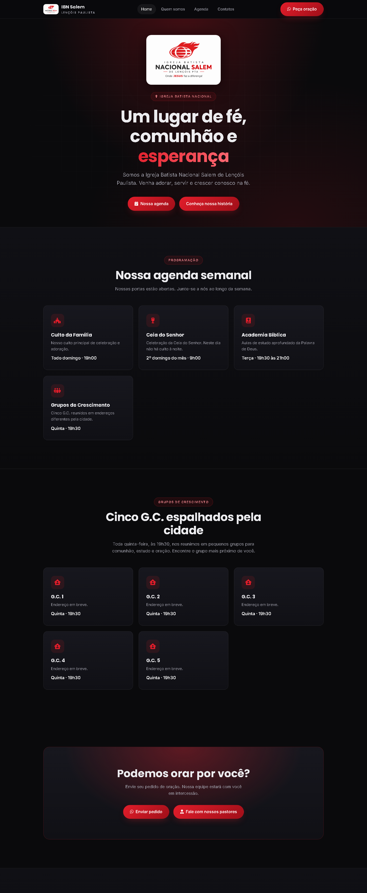
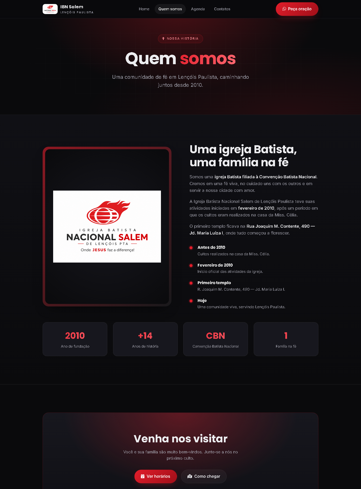
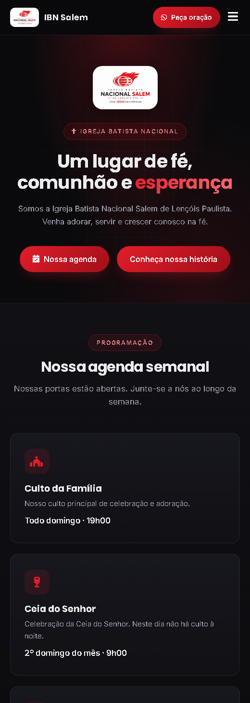
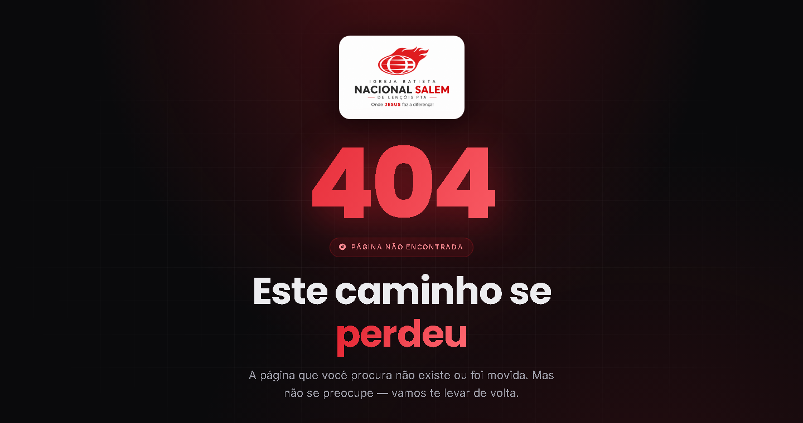

<div align="center">


# Igreja Batista Nacional Salem

### Site institucional moderno, responsivo e seguro
Lençóis Paulista • SP

<p>
  <a href="https://mrguerreiro.github.io/IBN_Salem/">
    
  </a>
</p>

<p>
  
  
  
  
</p>

</div>

---

## ✨ Sobre o projeto

Site institucional da **Igreja Batista Nacional Salem**, comunidade fundada em 2010 e filiada à Convenção Batista Nacional. O projeto foi **reconstruído do zero** a partir de um site antigo, adotando um visual moderno (tema escuro com o vermelho da marca), tipografia fluida e uma experiência totalmente responsiva — do celular ao desktop.

Tudo é **estático** (HTML, CSS e JavaScript puro), sem dependências pesadas, o que torna o site rápido, leve e fácil de hospedar.

> 🌐 **Acesse online:** [mrguerreiro.github.io/IBN_Salem](https://mrguerreiro.github.io/IBN_Salem/)

---

## 🖼️ Prévia

<div align="center">

### 🏠 Página inicial


### ℹ️ Quem somos


<table>
  <tr>
    <td align="center" width="50%">
      <strong>📱 Versão mobile</strong><br/><br/>
      
    </td>
    <td align="center" width="50%">
      <strong>🚫 Página 404 personalizada</strong><br/><br/>
      
    </td>
  </tr>
</table>

</div>

---

## 🚀 Funcionalidades

- 🎨 **Design moderno** — tema escuro, gradientes, tipografia fluida (`clamp()`) e animações suaves
- 📱 **100% responsivo** — layout adaptável com pontos de quebra em 900px, 760px e 400px
- 🍔 **Menu mobile** — navegação em hambúrguer com animação
- ✨ **Reveal on scroll** — seções surgem ao rolar a página (via `IntersectionObserver`)
- 📅 **Agenda semanal** — cultos, Ceia do Senhor, Academia Bíblica e Grupos de Crescimento
- 🙏 **Pedido de oração** — botão que abre direto o WhatsApp da igreja
- 👤 **Fale com os pastores** — contato direto via WhatsApp de cada pastor
- 📍 **Localização** — botão "Onde estamos" com integração ao Google Maps
- 🔗 **Redes sociais** — Facebook, Instagram e YouTube
- 🚫 **Página 404** personalizada com a identidade visual do site

---

## 🛠️ Tecnologias

| Camada | Tecnologia |
|--------|-----------|
| Estrutura | **HTML5 semântico** (`header`, `nav`, `section`, `footer`) |
| Estilo | **CSS3** — Custom Properties, Grid, Flexbox, `clamp()`, `backdrop-filter` |
| Interatividade | **JavaScript** (vanilla, sem frameworks) |
| Tipografia | Google Fonts — *Inter* + *Poppins* |
| Ícones | Font Awesome 6 |
| Servidor | **Apache** (`.htaccess`) — HostGator |

---

## 📁 Estrutura

```
IBN Salem/
├── index.html            # Página inicial
├── QuemSomos.html        # História da igreja
├── 404.html              # Página de erro personalizada
├── style.css             # Design system + responsividade
├── script.js             # Menu mobile, reveal on scroll, ano do rodapé
├── .htaccess             # HTTPS, segurança e performance (Apache)
├── Assets/
│   ├── Imagens/          # Logos e ícones
│   └── videos/           # Vídeos institucionais
└── docs/
    └── screenshots/      # Imagens usadas neste README
```

---

## 🔒 Segurança

O site aplica boas práticas de segurança em duas camadas:

**No HTML (`<meta>`)**
- 🛡️ **Content Security Policy (CSP)** — só permite recursos de origens confiáveis
- 🔐 **Subresource Integrity (SRI)** — valida o arquivo do CDN (Font Awesome)
- 🕵️ **Referrer Policy** + `rel="noopener noreferrer"` em todos os links externos

**No servidor (`.htaccess`)**
- 🔒 Redirecionamento forçado para **HTTPS** + **HSTS**
- 🚧 **X-Frame-Options** (anti-clickjacking) e **X-Content-Type-Options**
- 🎛️ **Permissions-Policy** desativando câmera, microfone e geolocalização
- 📦 Compressão **GZIP** e **cache** do navegador para mais performance

---

## 💻 Como executar localmente

Por ser um site estático, basta abrir o `index.html` no navegador.
Para simular o ambiente real (com os caminhos absolutos da página 404), rode um servidor local:

```bash
# Python 3
python -m http.server 8000

# ou Node.js
npx serve
```

Depois acesse **http://localhost:8000**.

---

## 🌐 Deploy (HostGator)

1. Acesse o **cPanel → Gerenciador de Arquivos → `public_html`**
2. Envie todos os arquivos mantendo a estrutura (incluindo o `.htaccess` — ative *"Mostrar arquivos ocultos"*)
3. Ative o **SSL/HTTPS** no domínio (cPanel → *SSL/TLS Status → Run AutoSSL*)
4. Pronto! O `.htaccess` cuida do redirecionamento HTTPS e dos cabeçalhos de segurança

---

## 📱 Responsividade

| Ponto de quebra | Comportamento |
|-----------------|---------------|
| **> 900px** | Layout completo em colunas |
| **≤ 900px** | Seção "Quem somos" em coluna única |
| **≤ 760px** | Menu vira hambúrguer; rodapé empilhado |
| **≤ 400px** | Botão do topo só com ícone; botões empilhados |

---

<div align="center">

## 📬 Contato

**Igreja Batista Nacional Salem**
📍 Rua João Carneiro Geraldes, 335 — Jd. Ubirama, Lençóis Paulista/SP
💬 WhatsApp: (14) 99715-0351

[](https://www.facebook.com/igrejabatistanacionalsalem)
[](https://www.instagram.com/ibnsalemlp)
[](https://youtube.com/@igrejabatistanacionalsalem999)

<br/>

<sub>© Igreja Batista Nacional Salem — Todos os direitos reservados.</sub>

</div>
